# C4 Component — Extractor (Level 3)

> Zoom vào container `Extractor` từ [c4_container.md](./c4_container.md). Mỗi
> component = 1 module Python có ranh giới rõ ràng + interface gọi nội bộ.
> Component này là **scope của agent `extractor`** trong Pattern B.

## Diagram

```mermaid
flowchart TB
    %% ========== EXTERNAL ==========
    cron(["⏰ K8s CronJob<br/>0 19 * * * UTC"])
    gitlab[("🔗 GitLab API v4<br/>git.fpt.net/api/v4")]
    pg_raw[("🗄️ gitlab_raw.*<br/>(10 target tables)")]
    pg_state[("🗄️ gitlab_raw.pipeline_state<br/>cursors + failures")]
    dlt_cache[("📁 ~/.dlt/pipelines/gitlab_kpi/<br/>schema cache (out-of-repo)")]
    validator_ext[/"src/validation/<br/>schema_validator.py<br/><i>Pydantic models</i>"/]

    %% ========== EXTRACTOR INTERNALS ==========
    subgraph EXT["📦 Extractor Container &nbsp;(src/extraction/)"]
        direction TB

        entry["run.py / pipeline.py<br/><i>entrypoint: main()<br/>parse --since-days, --source, --backfill</i>"]

        subgraph CORE["Core infra"]
            client["client.py<br/><b>GitLabAPIClient</b><br/><i>requests.Session<br/>Private-Token header<br/>exponential backoff 1s/2s/4s<br/>circuit breaker 5 fails → 60s open</i>"]
            checkpoint["checkpoint.py<br/><b>get_last_cursor()<br/>write_checkpoint()</b><br/><i>atomic UPSERT to pipeline_state<br/>per-resource watermark</i>"]
            pipeline_mod["pipeline.py<br/><b>build_pipeline()</b><br/><i>dlt.pipeline name=gitlab_kpi<br/>destination=postgres<br/>dataset=gitlab_raw</i>"]
        end

        subgraph SRCS["Resources (src/extraction/sources/ — 8 dlt @resource)"]
            direction LR
            r_mr["merge_requests.py<br/><i>list + per-iid /changes<br/>PK: id, cursor: updated_at</i>"]
            r_c["commits.py<br/><i>?with_stats=true<br/>PK: id (SHA), cursor: created_at</i>"]
            r_p["pipelines.py<br/><i>per-project loop<br/>PK: id, cursor: updated_at</i>"]
            r_pj["pipeline_jobs.py<br/><i>per-pipeline expand<br/>created_at as TEXT</i>"]
            r_tr["test_reports.py<br/><i>handle 404 → None<br/>per-pipeline</i>"]
            r_mc["mr_commits.py<br/><i>max 500/MR<br/>PK: [mr_id, commit_id]</i>"]
            r_mn["mr_notes.py<br/><i>PK: [mr_id, note_id]</i>"]
            r_gm["group_members.py<br/><i>group 756 roster<br/>PK: id</i>"]
        end

        subgraph HEAL["Healer + ops"]
            healer["healer (src/healer/)<br/><i>read pipeline_state<br/>if consecutive_failures ≥ 3<br/>→ Slack #ops-alert + STOP</i>"]
        end
    end

    %% ========== FLOWS ==========
    cron --> entry
    entry --> pipeline_mod
    pipeline_mod -- "build resources()" --> SRCS
    pipeline_mod -- "load cursors" --> checkpoint
    checkpoint -- "SELECT/UPSERT" --> pg_state

    r_mr   -- "GET /projects/:id/merge_requests<br/>+ /merge_requests/:iid (single, has additions/deletions)" --> client
    r_c    -- "GET /projects/:id/repository/commits?with_stats=true" --> client
    r_p    -- "GET /projects/:id/pipelines" --> client
    r_pj   -- "GET /projects/:id/pipelines/:pid/jobs" --> client
    r_tr   -- "GET /projects/:id/pipelines/:pid/test_report" --> client
    r_mc   -- "GET /projects/:id/merge_requests/:iid/commits" --> client
    r_mn   -- "GET /projects/:id/merge_requests/:iid/notes" --> client
    r_gm   -- "GET /groups/:id/members" --> client

    client -- "HTTPS GET + Private-Token<br/>retry 3, backoff 1/2/4s" --> gitlab
    SRCS -- "yield dict rows" --> pipeline_mod
    pipeline_mod -- "validate each row" --> validator_ext
    validator_ext -. "Pydantic schema OK" .-> pipeline_mod
    pipeline_mod -- "dlt merge(primary_key=PK,<br/>write_disposition='merge')" --> pg_raw
    pipeline_mod -- "read/write" --> dlt_cache
    pipeline_mod -- "on success: advance cursors" --> checkpoint
    pipeline_mod -- "on failure: increment counter" --> checkpoint
    healer -- "watch counter" --> pg_state

    %% ========== STYLING ==========
    classDef component fill:#1168bd,stroke:#0b4884,color:#fff
    classDef external fill:#999,stroke:#666,color:#fff
    classDef store fill:#438dd5,stroke:#2e6295,color:#fff
    classDef job fill:#85bbf0,stroke:#5d82a8,color:#000
    class entry,client,checkpoint,pipeline_mod,r_mr,r_c,r_p,r_pj,r_tr,r_mc,r_mn,r_gm,healer component
    class gitlab,pg_raw,pg_state,dlt_cache,validator_ext external
    class cron job
```

## Component responsibilities

| Component | File | Single responsibility |
|---|---|---|
| **Entrypoint** | `src/extraction/pipeline.py` | Parse CLI args; build dlt pipeline; orchestrate resource list; commit cursors on success. |
| **GitLabAPIClient** | `src/extraction/client.py` | All HTTPS calls — adds `Private-Token`, handles 4xx/5xx, retries with backoff, opens circuit on 5 consecutive failures. |
| **Checkpoint** | `src/extraction/checkpoint.py` | Read/write `gitlab_raw.pipeline_state` row per resource. Atomic UPSERT. `get_last_cursor()` / `write_checkpoint()`. |
| **8 Resource modules** | `src/extraction/sources/*.py` | Each = 1 dlt `@resource`. Yields dict rows; declares `primary_key` + `write_disposition='merge'`. Knows endpoint shape + gotchas (e.g. `with_stats=true` for commits). |
| **Healer** | `src/healer/` | Read-only on `pipeline_state`. If `consecutive_failures ≥ 3` → POST Slack and STOP (max 3 retries — CLAUDE.md constraint #6). |

## Cross-component invariants (CLAUDE.md anti-hallucination checklist)

These rules are enforced **by design**, not by review:

1. **All resources** declare explicit `primary_key` + `write_disposition='merge'` (CLAUDE.md constraint #4). Adding a new resource without PK = blocked by validator.
2. **Validator gate** — every yielded row passes through `schema_validator.py` Pydantic model **before** dlt writes. Schema drift in GitLab API surfaces here, not at downstream dbt.
3. **List vs single endpoint discipline** — `additions/deletions` MUST come from the single MR endpoint (`/merge_requests/:iid`), never from list. Enforced inside `merge_requests.py` via `client.get_mr_with_changes(project_id, iid)`.
4. **Cursor write is atomic with row commit** — checkpoint advances only after dlt confirms the merge. Mid-load crash leaves cursor at last successful page (see `known_gotchas` entry 2026-05-15 on cursor reset).
5. **Healer never modifies pipeline_state** — read-only. Reset on failure happens via separate manual `ops:triage` job.

## Failure modes mapped to component

| Failure | Where it surfaces | Recovery |
|---|---|---|
| GitLab 5xx / timeout | `client.py` | retry 3 × backoff; then circuit-breaker 60s |
| GitLab 403 (e.g. project 4618 archived) | `sources/pipelines.py` | log + skip (per-project), do not abort run |
| Pydantic ValidationError | `validation/schema_validator.py` | dlt row dropped + logged; `consecutive_failures++` if all rows invalid |
| dlt schema cache stale (array→scalar migration) | `pipeline.py` + `~/.dlt/.../schema.json` | manual scrub + `bump_version_if_modified` (2026-05-15 gotcha) |
| Cursor advance after partial load | `checkpoint.py` + `pipeline_state` | manual reset to `MAX(<watermark>)` then retry |
| `consecutive_failures ≥ 3` | `healer/` | Slack #ops-alert + STOP — human triage |

## Not in this diagram

- The 12 dbt models that consume `gitlab_raw.*` → see `src/transform/models/` (own zoom-in TBD if needed).
- Webhook receiver internals (Phase 2) — separate component diagram when shipped.
