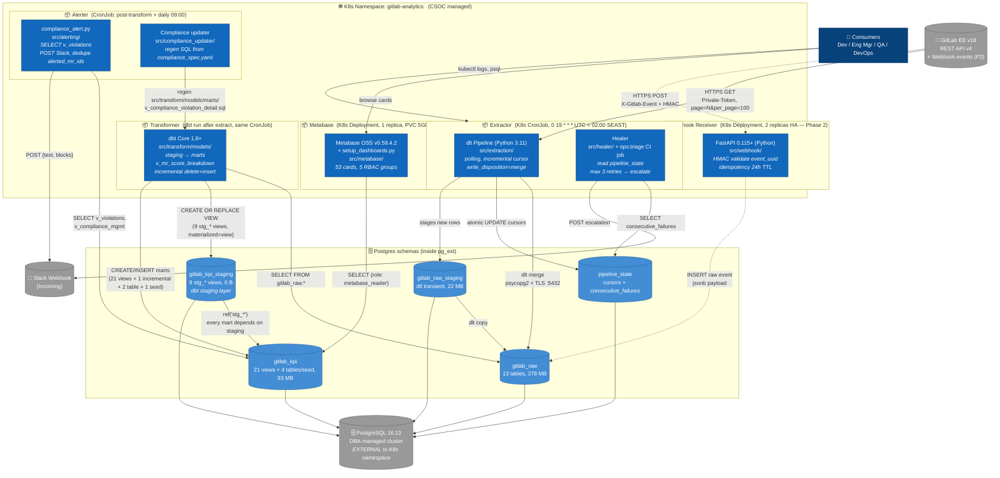

# C4 Container — Level 2

> Zoom 1 cấp vào "GitLab Compliance Analytics Platform". Mỗi container = đơn vị
> deploy độc lập (K8s CronJob, Deployment, hoặc external service). Tech stack
> + protocol + ownership được note inline.

## Diagram



## Container catalog

| # | Container | Tech | Deploy | Owner agent | Source |
|---|---|---|---|---|---|
| 1 | **Extractor** | Python 3.11 + dlt 1.4+ | K8s CronJob (`0 19 * * * UTC`) | `extractor` (Pattern B) | `src/extraction/` |
| 2 | **Healer** | Python + psycopg2 | Same CronJob + `ops:triage` (.gitlab-ci.yml) | `healer` | `src/healer/` |
| 3 | **Webhook Receiver** *(Phase 2)* | FastAPI 0.115+ + Pydantic | K8s Deployment, 2 replicas, HPA on CPU>70% | `extractor` | `src/webhook/` |
| 4 | **Transformer (dbt)** | dbt Core 1.8+ | Run inline after extractor | `transformer` | `src/transform/models/` |
| 5 | **Alerter** | Python + Slack SDK | CronJob (post-transform + daily 09:00) | `alerter` | `src/alerting/compliance_alert.py` |
| 6 | **Compliance updater** | Python codegen | On-demand `python -m src.compliance_updater apply` | `transformer` | `src/compliance_updater/` |
| 7 | **Metabase** | Metabase OSS v0.59 | K8s Deployment, 1 replica, PVC 5GB H2 metadata | `transformer` (dashboards) | `src/metabase/setup_dashboards.py` |
| 8 | **PostgreSQL** | PG 16.13 (Alpine) | **EXTERNAL** — DBA cluster | — (consumed) | `src/infra/db/migrations/` |

## Data store catalog (logical, all inside one PG cluster)

| Schema | Purpose | Owner role | Size (2026-05-20) |
|---|---|---|---|
| `gitlab_raw` | dlt landing zone — 13 tables (MR, commits, pipelines, ...) | `dlt_writer` | 278 MB |
| `gitlab_kpi_staging` | **dbt staging layer** — 9 `stg_*` views, every mart `ref()`-s here. Materialized=view → 0 disk. | `dlt_writer` (write); internal only | 0 B |
| `gitlab_kpi` | dbt marts — 21 views + 1 incremental table (`v_mr_score_breakdown`) + 2 tables + 1 seed | `dlt_writer` (write), `metabase_reader` (read) | 93 MB |
| `gitlab_raw_staging` | dlt transient staging during merge (NOT consumed by marts) | `dlt_writer` | 22 MB |
| `gitlab_raw.pipeline_state` | extraction cursors + consecutive_failures | `dlt_writer` | <1 MB |

> **Naming gotcha**: cùng có chữ "staging" nhưng `gitlab_kpi_staging` (dbt-managed views) và `gitlab_raw_staging` (dlt transient tables) là **2 schema khác hoàn toàn**. dbt suffix `_staging` từ `dbt_project.yml: staging.+schema: staging` ghép với profile target `gitlab_kpi`. dlt suffix `_staging` là default convention của dlt destination.

## Deployment notes (SDD §8.1)

- **Replicas**: webhook 2 (HA), Metabase 1 (OSS limit, H2 metadata), Extractor 1 (cron-driven, no HPA).
- **Resource quota**: 2 vCPU / 4 GB RAM / 5 GB PVC (Metabase + webhook only). Extractor uses ephemeral CronJob pod.
- **Auto-scaling**: HPA only on webhook (CPU > 70%). Extractor stays at 1 (avoid GitLab rate limit).
- **Network**: outbound to `git.fpt.net:443`, `hooks.slack.com:443`, DBA cluster `:5432`. No inbound (Phase 2 will open ingress for `/v1/webhook`).

## Trust boundaries

```
┌──────────────────────── INTERNET ────────────────────────┐
│   (none — system is fully on-prem / internal network)    │
└──────────────────────────────────────────────────────────┘
                            │
┌──────────────────── FPT internal network ────────────────┐
│  git.fpt.net  ←─── HTTPS + Private-Token ─── extractor    │
│  hooks.slack.com ← HTTPS POST ──────────────── alerter    │
│                                                           │
│  ┌─────── K8s namespace (CSOC) ──────────┐                │
│  │  extractor, webhook, dbt, alerter,    │                │
│  │  metabase   (all containers above)    │                │
│  └────────────────┬──────────────────────┘                │
│                   │ pg wire :5432 + TLS                   │
│  ┌────────────────▼────────────────────┐                  │
│  │  Postgres cluster (DBA-managed,      │                  │
│  │  EXTERNAL to K8s namespace)          │                  │
│  └─────────────────────────────────────┘                  │
└──────────────────────────────────────────────────────────┘
```
