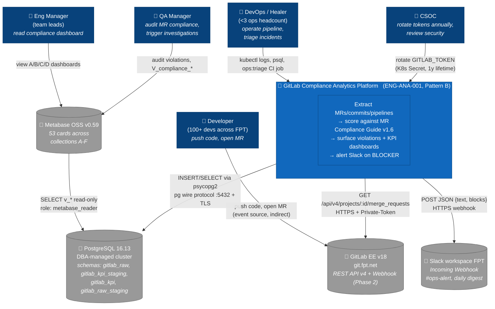

# C4 Context — Level 1

> Zoom out nhất. Hệ thống `gitlab-analytics` đứng giữa các actor (con người sử dụng
> sản phẩm) và 4 external system (GitLab, Postgres DBA cluster, Slack, Metabase).
> Không có chi tiết internal container — đó là Level 2 ([c4_container.md](./c4_container.md)).

## Diagram

## Legend

| Shape | Meaning |
|---|---|
| Person box `👤` | Human actor (Developer, Manager, Ops) |
| Solid box `🎯` | System in scope of this design |
| Database cylinder `🔗 (..)` | External system (out of scope — black box) |
| Arrow | Synchronous interaction; label = protocol + intent |

## Key decisions reflected here

- **Single tenant** — 1 GitLab group (id=756, see `.claude/memory/known_projects.yaml`), no multi-tenancy.
- **Postgres is EXTERNAL**, DBA-managed (SDD §8.2) — not deployed in our K8s namespace.
- **Metabase read-only** to Postgres (separate role `metabase_reader`, SDD §7.3) — never writes back.
- **Slack outbound only** — we POST, never receive. (Webhook receiver for GitLab events is Phase 2, distinct flow.)
- **CSOC owns token lifecycle** — yearly GAT rotation (SDD §4.2).

## What's NOT in this diagram

- Container-level decomposition → see [c4_container.md](./c4_container.md)
- Sequence of operations → see [seq_daily_etl.md](./seq_daily_etl.md)
- DB schema → see [`docs/reference/db_erd.md`](../reference/db_erd.md)
