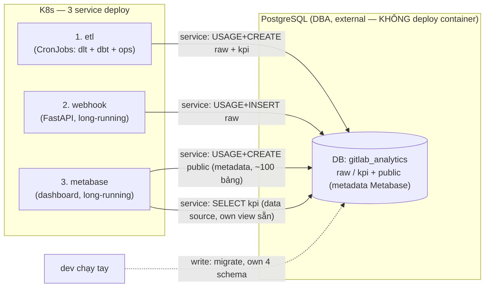

# Deploy topology — services → DB → quyền

3 service deploy lên container, **1 DB duy nhất** `gitlab_analytics` (PostgreSQL external do DBA quản, không phải container). Metadata Metabase để CHUNG (schema `public`) — không tách.

## Bảng quyền (tất cả trên 1 DB `gitlab_analytics`)

| Service | Kết nối | Account | Quyền |
|---|---|---|---|
| etl — extract (dlt) | trực tiếp | service | USAGE + CREATE — `gitlab_raw`, `gitlab_raw_staging` |
| etl — transform (dbt) | trực tiếp | service | USAGE + CREATE — `gitlab_kpi`, `gitlab_kpi_staging` |
| etl — migrate (dev tay) | trực tiếp | write | own 4 schema, chạy migration |
| webhook | trực tiếp | service | USAGE + INSERT — `gitlab_raw` |
| metabase — metadata (MB_DB) | trực tiếp | service | **USAGE + CREATE — `public`** (tạo ~100 bảng) ⟵ grant thêm cho service |
| metabase — data source (vẽ chart) | query live | service | SELECT — `gitlab_kpi` (own view sẵn, không cần grant) |

> ✅ Không tách DB. Metabase vẫn chỉ **1 Vault secret** (`MB_DB_*`); data source `gitlab_kpi` khai 1 lần trong Metabase lúc setup, không qua Vault.
> 🔧 Fix Metabase crash-loop: DBA **grant account Metabase quyền CREATE** trên `public` (hiện 0 quyền → không tạo bảng → chết).
