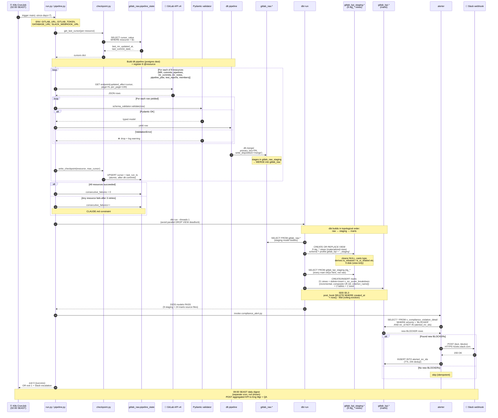

# Sequence — Flow 1: Daily ETL Extraction

> Critical path. Cron `0 19 * * * UTC` (= 02:00 SEAST) → resync incremental MRs /
> commits / pipelines from GitLab vào Postgres, run dbt, alert Slack. SLA: 2h
> end-to-end. Liên quan SDD §5.1, §5.2 (dbt incremental), §7.2 (retry policy).

## Diagram

## Error handling per phase

Reference: SDD §5.1 "Error handling cho flow này" + CLAUDE.md Loop Logic table.

| Phase / actor | Failure mode | Action | Max retry |
|---|---|---|---|
| Cursor read (CP↔State) | PG down | retry psycopg2 connect 3× | 3 |
| GitLab GET (Run→GL) | 5xx / timeout | exponential backoff 1s, 2s, 4s | 3 |
| GitLab GET (Run→GL) | 429 rate limit | sleep `Retry-After` then resume | unlimited (1 worker per resource) |
| GitLab GET (Run→GL) | 403 on specific project (e.g. 4618) | log warn + skip project, continue iteration | n/a |
| Pydantic (Run→Val) | ValidationError | drop row + log; if **all** rows of a resource invalid → fail resource | n/a |
| dlt merge (DLT→Raw) | schema cache stale | manual scrub `~/.dlt/.../schema.json` + `bump_version_if_modified` | 1 |
| dlt merge (DLT→Raw) | cursor advanced but rows not loaded | manual reset cursor to `MAX(<watermark>)` then retry | 1 |
| dbt run (DBT→Stg or DBT→KPI) | model fails | retry once; if still fails → escalate (data may be partial). Staging fail blocks marts (topological dep) | 1 |
| Slack POST (Alert→Slack) | webhook 4xx/5xx | retry 3× backoff; if still fails → log + continue (alert is best-effort) | 3 |
| Any (3 retries exhausted) | — | `consecutive_failures++`; healer POSTs #ops-alert at ≥3, STOP | hard cap 3 |

## Timing budget (target)

> Step numbers are illustrative — `autonumber` re-counts on every edit. Treat phases as labels, not hardcoded step IDs.

| Phase | Target wall-clock | Notes |
|---|---|---|
| Cursor read (Run ↔ State) | < 1s | Single UPSERT batch |
| GitLab extract (Run ↔ GL loop) | 30–90 min | 8 resources × ~500 pages; 1 worker each (avoid rate limit) |
| dbt build staging (DBT → Stg) | ~30s | 9 view DDL — cheap, no data move |
| dbt build marts (DBT → KPI) | 5–10 min | 24 marts + incremental `v_mr_score_breakdown` (delete+insert), `--threads 1` |
| Alerter (Alert ↔ Slack) | < 1 min | 1 SELECT + 0–N Slack POSTs |
| **Total** | **≤ 2h** | SLA per SDD §5.1 |

## Cross-references

- Sequence of dbt incremental compute (per-MR scoring) → SDD §5.2 (no separate diagram — covered by `DBT → Stg → KPI` block here).
- Webhook event flow (Phase 2) → SDD §5.3 (not deployed yet).
- Component-level zoom of extractor → [c4_component_extractor.md](./c4_component_extractor.md).
- Schema layering raw → stg → marts → [`docs/reference/db_inventory.md`](../reference/db_inventory.md).
- ERD of `gitlab_raw.*` tables → [`docs/reference/db_erd.md`](../reference/db_erd.md).
