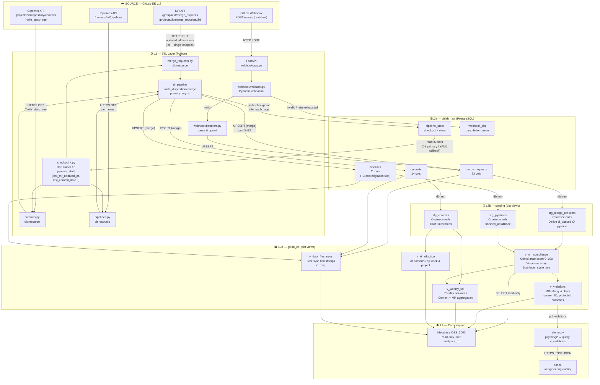
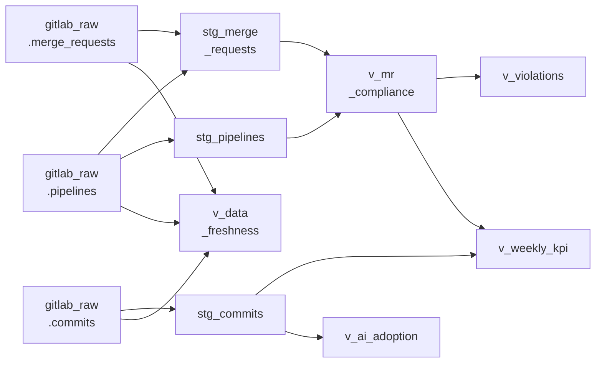
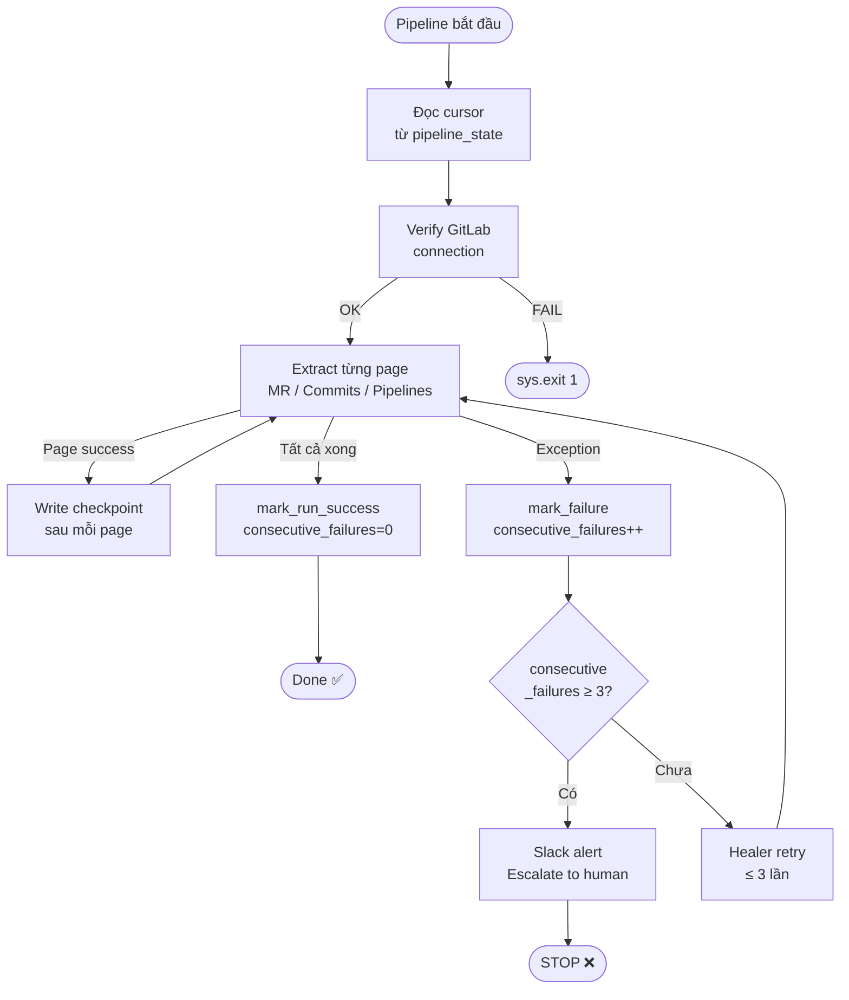

# ETL Architecture — GitLab Analytics Pipeline
> ENG-ANA-001 | v1.0 | Cập nhật: 2026-03-28

---

## 1. Tổng quan luồng data (end-to-end)



---

## 2. Chi tiết từng layer

### L1 — Source: GitLab EE v18

| Endpoint | Dùng để lấy | Ghi chú quan trọng |
|---|---|---|
| `GET /groups/:id/merge_requests` | List MR (không có size) | Không có `additions/deletions` |
| `GET /projects/:id/merge_requests/:iid` | Single MR — có size | **Bắt buộc** để lấy additions/deletions |
| `GET /projects/:id/repository/commits` | Commits | Phải thêm `?with_stats=true` |
| `GET /projects/:id/pipelines` | Pipelines | `coverage` có thể null |
| `POST /webhook` | Real-time events | FastAPI nhận và xử lý |

---

### L2 — ETL: Python + dlt

**File chính:** [src/extraction/pipeline.py](../src/extraction/pipeline.py)

**Luồng xử lý mỗi lần chạy:**
```
1. Đọc cursor từ pipeline_state (DB) hoặc YAML fallback
2. Xác thực kết nối GitLab (client.verify_connection)
3. Khởi tạo dlt pipeline → destination=postgres, dataset=gitlab_raw
4. Chạy 3 source song song: merge_requests / commits / pipelines
5. Sau mỗi page thành công → ghi checkpoint vào pipeline_state
6. Khi xong → mark_run_success(), reset consecutive_failures
7. Nếu lỗi → mark_failure(), gửi Slack alert, sys.exit(1)
```

**Checkpoint system** ([src/extraction/checkpoint.py](../src/extraction/checkpoint.py)):

| Key | Ý nghĩa |
|---|---|
| `last_mr_updated_at` | Cursor cho MR sync |
| `last_commit_date` | Cursor cho commit sync |
| `last_pipeline_updated_at` | Cursor cho pipeline sync |
| `last_successful_run` | Timestamp run thành công gần nhất |
| `consecutive_failures` | Đếm lỗi liên tiếp (Healer dùng, max 3) |
| `alerted_mr_ids` | MR đã gửi Slack (tránh duplicate, giữ 500 gần nhất) |

**Idempotency:** mọi bảng đều dùng `write_disposition="merge"` + `primary_key="id"` → chạy lại bao nhiêu lần cũng an toàn.

---

### L3a — Raw tables: gitlab_raw

| Table | Rows (ước tính/sprint) | Key columns |
|---|---|---|
| `merge_requests` | ~50–200 MR | `id`, `author_username`, `mr_size`, `ci_passed`, `has_description`, `has_ticket_ref` |
| `commits` | ~500–2000 | `id` (SHA), `is_ai`, `is_conventional`, `total_loc`, `committed_date` |
| `pipelines` | ~200–1000 | `id`, `status`, `coverage`, `duration`, `finished_at` |
| `pipeline_state` | 8 rows (fixed) | Checkpoint store |
| `webhook_dlq` | Variable | Events failed after retry |

**Migration history:**

| File | Tác dụng |
|---|---|
| `001_init_schemas.sql` | Tạo schema gitlab_raw, gitlab_kpi, analytics_ro role |
| `002_webhook_dlq.sql` | Tạo bảng dead-letter queue cho webhook |
| `003_pipeline_state.sql` | Tạo bảng checkpoint + seed keys |
| `004_pipelines_add_timing_coverage.sql` | Thêm `finished_at`, `duration`, `coverage` vào pipelines |

---

### L3b — Staging: dbt views (schema: staging)

Mục đích: normalize raw data, coalesce null, cast timestamp — **không aggregate**.

| View | Nguồn | Xử lý đặc biệt |
|---|---|---|
| `stg_merge_requests` | gitlab_raw.merge_requests + pipelines | Derive `ci_passed` từ latest pipeline (workaround API quirk) |
| `stg_commits` | gitlab_raw.commits | Cast, coalesce |
| `stg_pipelines` | gitlab_raw.pipelines | `finished_at` fallback = `updated_at` cho bản ghi cũ |

---

### L3c — KPI views: dbt views (schema: gitlab_kpi)

| View | Nguồn | Mục đích |
|---|---|---|
| `v_mr_compliance` | stg_merge_requests + stg_pipelines | Score 0–100, violations array, size_label, cycle_time |
| `v_violations` | v_mr_compliance | Filter MR vi phạm trên protected branch |
| `v_weekly_kpi` | stg_commits + v_mr_compliance | Aggregation per-dev per-week |
| `v_ai_adoption` | stg_commits | AI commit% by week & project |
| `v_data_freshness` | 3 raw tables | Timestamp sync gần nhất (1 row) |

**Compliance score breakdown:**

```
has_description   → +20
has_ticket_ref    → +15
ci_passed         → +25
mr_size ≤ 400     → +20 | ≤ 700 → +10 | > 700 → 0
coverage ≥ 80%    → +20 | ≥ 60% → +10 | < 60% → 0
                   ─────
                    100 điểm tối đa
```

---

### L4 — Consumption

| Consumer | Schema được phép đọc | Cách kết nối |
|---|---|---|
| Metabase | gitlab_kpi, staging (read-only) | User `analytics_ro`, port 3000 |
| alerter.py | gitlab_kpi.v_violations | psycopg2, DATABASE_URL |
| Slack | — | HTTPS POST JSON từ alerter |

---

## 3. Sơ đồ dbt lineage



---

## 4. Checkpoint & error handling



---

## 5. Lệnh vận hành thường dùng

```bash
# Chạy full ETL (7 ngày gần nhất)
python -m src.extraction.pipeline

# Chỉ sync MR
python -m src.extraction.pipeline --source mr

# Backfill 30 ngày (bỏ qua checkpoint)
python -m src.extraction.pipeline --backfill --since-days 30

# Chạy dbt transform sau khi extract xong
cd src/transform && dbt run

# Verify DB sau migration
bash src/infra/db/scripts/verify_migration_004.sh
```

---

*Tài liệu này được generate từ source code thực tế. Cập nhật khi có thay đổi schema hoặc luồng xử lý.*
