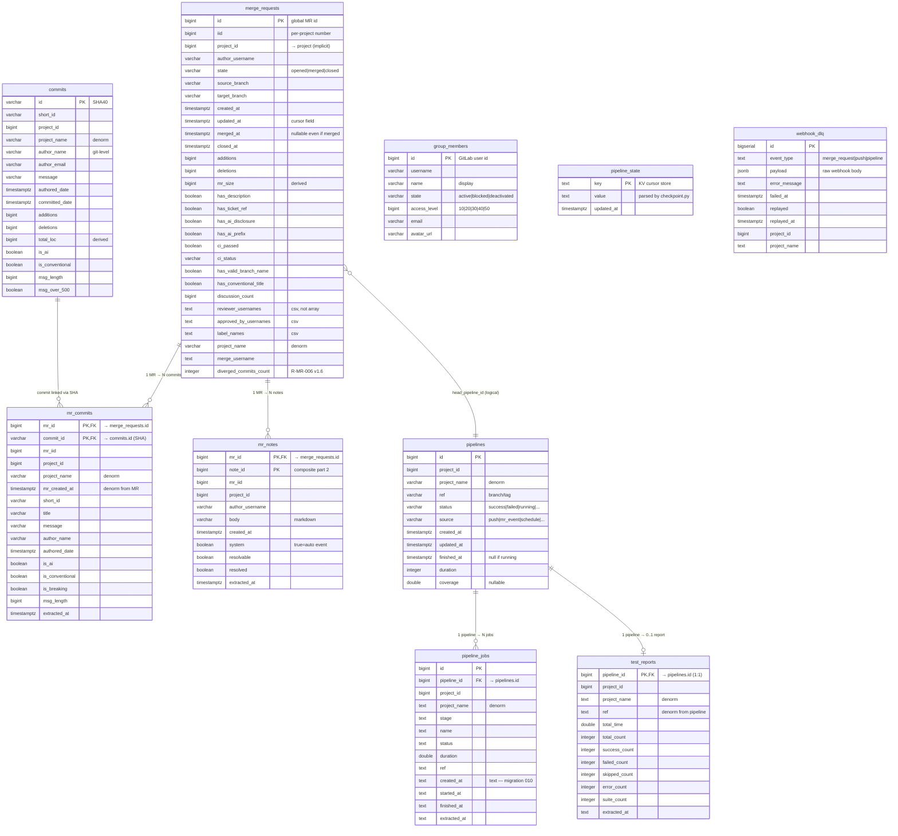
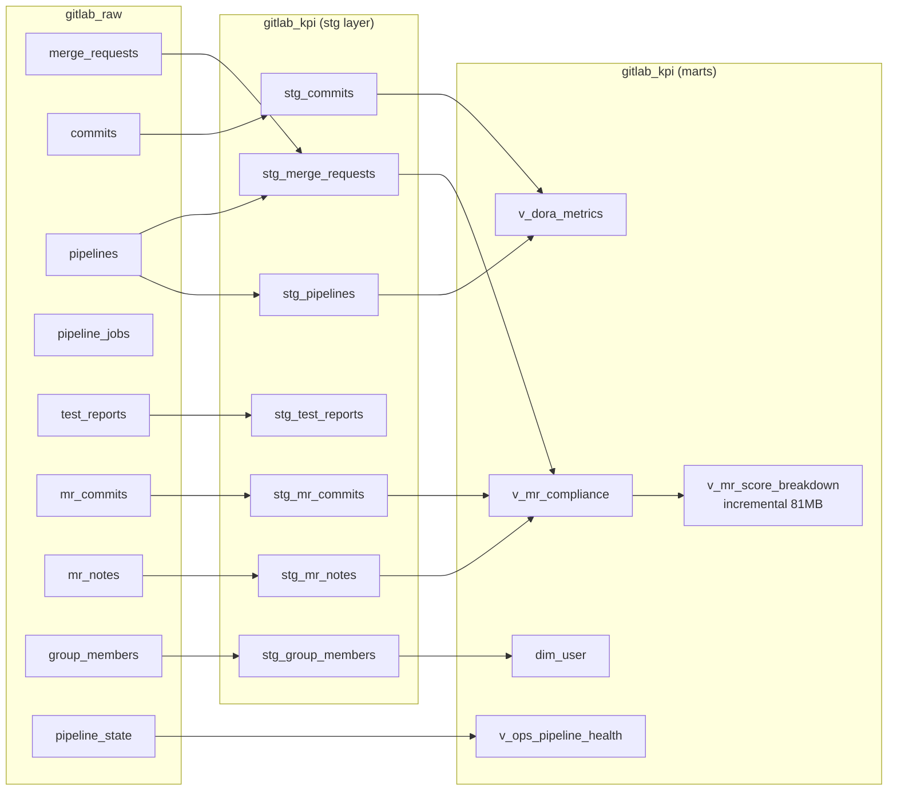

# ERD — `gitlab_raw` Schema

**Snapshot**: 2026-05-20 • **10 tables** • **278 MB** • **~739k rows**

> ⚠️ **No physical foreign keys.** dlt does NOT create `FOREIGN KEY` constraints. All relationships below are **logical** (enforced at the dbt staging layer via JOINs). PG-level integrity = none — extraction must guarantee referential validity.

---

## Diagram

---

## Relationships explained

### Strong (referential — extraction guarantees)

| From → To | Cardinality | Join key | Enforced where |
|---|---|---|---|
| `merge_requests` → `mr_commits` | 1:N | `mr_id = merge_requests.id` | `src/extraction/sources/merge_requests.py` populates both atomically |
| `merge_requests` → `mr_notes` | 1:N | `mr_id = merge_requests.id` | Same extraction pass |
| `pipelines` → `pipeline_jobs` | 1:N | `pipeline_id = pipelines.id` | `src/extraction/sources/pipelines.py` |
| `pipelines` → `test_reports` | 1:0..1 | `pipeline_id = pipelines.id` | At most one report per pipeline |

### Logical (cross-resource, eventual consistency)

| From → To | Cardinality | Join key | Caveat |
|---|---|---|---|
| `commits` → `mr_commits` | 1:N | `id = commit_id` (SHA) | Same commit can appear in N MRs (cherry-pick, multi-target). May lag — commit extraction is per-project, MR extraction is per-group. |
| `merge_requests` → `pipelines` | N:1 (head_pipeline) | `head_pipeline_id` (not stored as column — joined via `merge_requests_raw.head_pipeline` JSON in stg layer) | NULL when MR has no CI. `stg_merge_requests` resolves this. |
| `group_members` → all author fields | dimension | `username = author_username` | Used by `dim_user` for department mapping. |

### Independent (no relationship)

- `pipeline_state` — KV cursor table, populated by `src/extraction/checkpoint.py`
- `webhook_dlq` — currently empty (webhook chưa deploy prod)

---

## Implicit dimensions

These IDs appear across all fact tables but no `projects` dimension table exists in `gitlab_raw`:

- `project_id` (bigint) + `project_name` (text, denormalized in every table)
- Project metadata = scraped from `gitlab_group_members` job list + GitLab API on-demand

**Why no project table**: 5,872 projects in group 756, only ~351 active. Building a full dim_project would add 5MB for 6% utility. dbt layer materializes `dim_project` from active project union if needed.

---

## dlt internal columns (excluded from ERD for clarity)

Every table also has these from dlt write:
- `_dlt_load_id` (varchar) — batch ID (epoch timestamp)
- `_dlt_id` (varchar) — internal row hash (NOT for joins)
- `_dlt_root_id` / `_dlt_parent_id` / `_dlt_list_idx` — only on child tables of JSONB unnested arrays (none in current schema after migration 008 array→text sweep)

---

## Downstream — how `gitlab_kpi` views consume this

22 marts views + 3 tables + 1 seed total. See `docs/reference/db_inventory.md` §`gitlab_kpi` for full list.

---

## How to regenerate this ERD

ERD is **manually maintained** because:
1. dlt creates NO foreign keys → no auto-extraction tool (e.g. `pg_dump --schema-only` doesn't infer relationships)
2. Most relationships are denormalized (project_name, mr_iid in mr_commits) — not standard FK patterns

Update protocol when schema changes:
1. New table added → add Mermaid entity + relationship lines
2. New column added → update entity field list
3. Migration changes column type → update field type
4. Verify in GitLab/GitHub markdown preview (Mermaid native support)

Cross-ref:
- `docs/reference/db_fields_gitlab_raw.md` — column-level inventory (source of truth for fields)
- `docs/reference/db_inventory.md` — table-level sizing/usage
- `.claude/memory/schema_snapshot.yaml` — API field expectations
- `docs/reference/schema_reference.md` — full column-level schema spec
