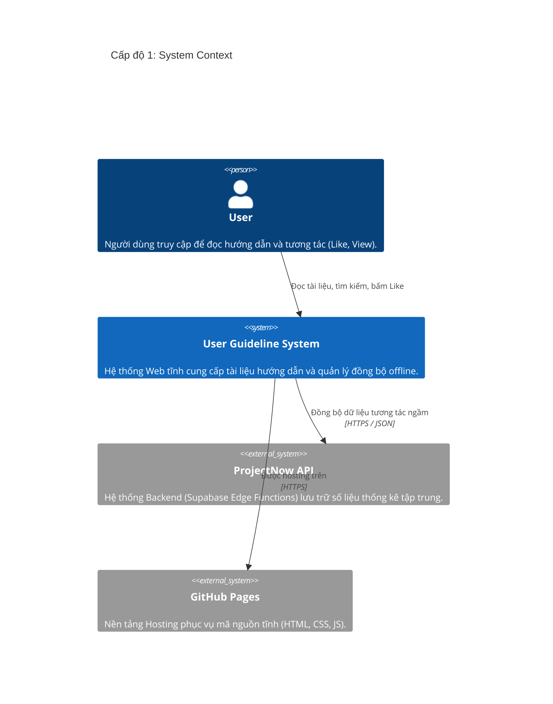
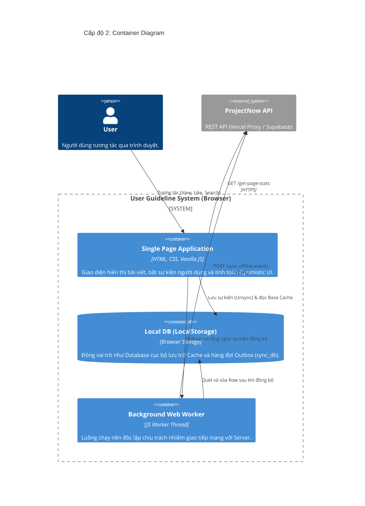

# Kiến Trúc Hệ Thống: User Guideline (C4 Model)

Tài liệu này mô tả kiến trúc của hệ thống **User Guideline** (Hoạt động hoàn toàn dưới dạng Static Site kết hợp Local-First / Offline-First) theo chuẩn C4 Model với 3 cấp độ: System Context, Container và Component.

---

## 1. Cấp độ 1: System Context (Bối cảnh hệ thống)
Sơ đồ này cho thấy bức tranh tổng thể về cách Người dùng tương tác với Hệ thống và cách Hệ thống giao tiếp với các Dịch vụ bên ngoài (ProjectNow API).



---

## 2. Cấp độ 2: Container (Hộp chứa)
Phóng to vào bên trong `User Guideline System`, chúng ta sẽ thấy hệ thống được cấu thành từ 3 Container chính chạy trực tiếp trên trình duyệt của người dùng.



---

## 3. Cấp độ 3: Component (Thành phần)
Phóng to vào bên trong Container `Single Page Application`, chúng ta thấy rõ luồng gọi hàm (Decoupled Architecture) và cách các file script tương tác với cơ sở dữ liệu Outbox.

```mermaid
C4Component
    title Cấp độ 3: Component Diagram

    Container_Boundary(spa, "Single Page Application (Trình duyệt)") {
        Component(data_js, "Data Catalog", "data.js", "Chứa danh sách siêu dữ liệu (Metadata) tĩnh của toàn bộ bài viết.")
        Component(ui_search, "Overview UI", "search.js", "Render trang chủ, lọc tìm kiếm, hiển thị số liệu Optimistic.")
        Component(ui_detail, "Detail UI", "interaction.js", "Bắt sự kiện Click Like, View khi người dùng đọc một bài cụ thể.")
        Component(sync_engine, "Sync Engine", "sync-engine.js", "Lõi Outbox Pattern: Cung cấp API Insert Row và hàm tính toán Optimistic UI tập trung.")
    }

    Container_Boundary(storage, "Browser Environment") {
        ComponentDb(sync_db, "sync_db", "LocalStorage Table", "Lưu các sự kiện (Row) chưa đồng bộ với UUID riêng biệt.")
        ComponentDb(base_cache, "Base Cache", "LocalStorage KV", "Lưu bộ nhớ đệm (view_id, like_id) để hiển thị ngay khi offline.")
        Component(worker_js, "Worker Script", "worker.js", "Chạy ngầm mỗi 10 giây, Group by dữ liệu và gọi Fetch API.")
    }

    System_Ext(api, "ProjectNow API", "Backend System")

    Rel_Down(ui_search, data_js, "Đọc danh sách bài")
    Rel_Right(ui_search, sync_engine, "Gọi tính Optimistic UI")
    Rel_Right(ui_detail, sync_engine, "Gọi pushToSyncQueue")
    
    Rel_Down(sync_engine, sync_db, "Insert/Delete Row (Outbox)")
    Rel_Down(sync_engine, base_cache, "Cộng dồn Cache sau Sync")
    
    BiRel_Right(sync_engine, worker_js, "PostMessage / Nhận Event")
    
    Rel_Right(worker_js, api, "POST /sync-offline-events", "JSON")
    Rel_Right(ui_search, api, "GET /get-page-stats", "JSON")
    Rel_Right(ui_detail, api, "GET /get-page-stats", "JSON")
```

---

> [!TIP]
> **Điểm nổi bật của Kiến trúc (Outbox Pattern + Eventual Consistency):**
> Nhìn vào **Cấp độ 3**, có thể thấy Giao diện (UI) và Giao tiếp Mạng (Network) bị chia cắt hoàn toàn bởi `sync_db`. UI chỉ biết ghi (Insert) dữ liệu vào ổ cứng, và đọc số ảo để hiển thị. 
> Việc đẩy dữ liệu lên Server là nhiệm vụ hoàn toàn độc lập của `worker.js`. Thiết kế này đảm bảo Ứng dụng không bao giờ bị "đơ" hay mất dữ liệu khi mất mạng.
